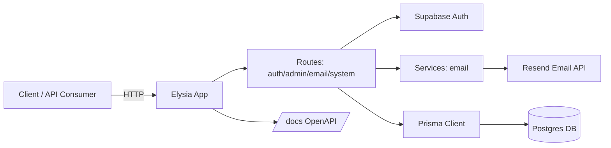

# elysia-supabase-template   

Elysia boilerplate + Supabase Auth + Postgres DB.
Starter Elysia/Bun backend with Supabase Auth, Prisma (Postgres), React Email/Resend, clustering, rate limiting, CORS, logging, OpenAPI docs, and admin/role enforcement.

## Structure
- `src/app.ts` – Elysia app factory (prefix `/`), middleware, routes.
- `src/index.ts` – cluster bootstrap/startup.
- `src/routes/` – route modules (`auth`, `admin`, `email`, `system`).
- `src/services/` – email helpers.
- `src/schemas/` – request validation (Elysia `t.*`).
- `src/lib/` – Prisma client, Supabase client, logger.
- `src/config/` – env parsing and normalized config.
- `src/utils/` – security headers, docs guard, password checks.
- `prisma/` – Prisma schema, migrations, seed.

## Overview / Architecture
- **Framework/runtime**: Elysia on Bun with clustering (`cluster`), rate limiting, CORS, security headers, and OpenAPI docs at `/docs`.
- **Auth**: Supabase Auth (email/password + magic link) with access/refresh tokens and admin guard via profiles.
- **Data**: Prisma/Postgres `profiles` table aligned to Supabase `auth.users`. Seed creates an admin profile.
- **Email**: React Email templates with Resend sender.
- **Logging**: `elysia-logger`; environment-driven levels.
- **Routing**: API served under `/`; routes split by domain in `src/routes`.
- **Prisma 7 config**: datasource URL lives in `prisma.config.ts` (not `schema.prisma`). Migrations require `DATABASE_URL`; runtime uses the Prisma Postgres adapter (`@prisma/adapter-pg`) with `pg` pool.



## Features
- Supabase Auth (email/password + magic link) with access/refresh tokens and profile sync.
- Prisma/Postgres schema (profiles + rate limits) with seed admin profile.
- React Email + Resend send endpoint.
- Docker Compose for Postgres; clustering via Node `cluster`; structured logging via elysia-logger.
- OpenAPI docs at `/docs`.

## Setup
1. Install Bun 1.3.5+ (recommended via `asdf` with `.tool-versions`), then dependencies: `bun install`
2. Copy `.env.example` to `.env` and set:
   - Required: `DATABASE_URL`, `SUPABASE_URL`, `SUPABASE_ANON_KEY`, `SUPABASE_SERVICE_ROLE_KEY`, `CORS_ORIGINS` (explicit origins in prod, not `*`).
   - Auth/Admin: `ADMIN_ROLE`, `ADMIN_EMAILS`, `FRONTEND_URL`, `SUPABASE_MAGIC_LINK_REDIRECT_URL`, `SUPABASE_PASSWORD_RESET_REDIRECT_URL`, `SIGNUP_MIN_PASSWORD_LENGTH`, `SIGNUP_PWNED_CHECKS`, `SIGNUP_RATE_LIMIT_WINDOW_MS`, `SIGNUP_RATE_LIMIT_MAX`.
   - Email: `RESEND_API_KEY`, `EMAIL_FROM` if using emails.
3. Start Postgres: `docker compose up -d db`
4. Migrate & seed: `DATABASE_URL=... bunx prisma migrate deploy && bunx prisma db seed` (Prisma 7 reads the URL from `prisma.config.ts` or env; `schema.prisma` no longer contains `url`).
5. Generate Prisma client: `DATABASE_URL=... bun run prisma:generate`
6. Run: `bun --watch src/index.ts` (or `docker compose up --build`)
7. Commits: follow [Conventional Commits](https://www.conventionalcommits.org/en/v1.0.0-beta.4/) for commit messages.

## Supabase Setup Guide
1. Create a new Supabase project and copy the project URL and API keys.
2. In Supabase SQL Editor, create the `public.profiles` table if you did not run Prisma migrations against the Supabase database.
3. Enable RLS and apply the minimal policies below:

```sql
-- Enable RLS
alter table public.profiles enable row level security;

-- A user can read their own profile
create policy "profiles_read_own"
on public.profiles
for select
using (auth.uid() = id);

-- A user can create their own profile
create policy "profiles_insert_own"
on public.profiles
for insert
with check (auth.uid() = id);

-- A user can update their own profile
create policy "profiles_update_own"
on public.profiles
for update
using (auth.uid() = id)
with check (auth.uid() = id);

-- Admins can read all profiles (based on profiles.role)
create policy "profiles_admin_read_all"
on public.profiles
for select
using (
  exists (
    select 1
    from public.profiles p
    where p.id = auth.uid()
      and p.role = 'admin'
  )
);

-- Admins can update all profiles (optional)
create policy "profiles_admin_update_all"
on public.profiles
for update
using (
  exists (
    select 1
    from public.profiles p
    where p.id = auth.uid()
      and p.role = 'admin'
  )
);
```

4. Set `.env` values: `SUPABASE_URL`, `SUPABASE_ANON_KEY`, `SUPABASE_SERVICE_ROLE_KEY`, and optional redirect URLs.
5. Configure Supabase Auth Redirect URLs to include:
   - Magic link: `${FRONTEND_URL}/auth`
   - Password reset: `${FRONTEND_URL}/auth/forget`

## Magic Link Flow (Frontend)
This backend exposes `POST /auth/magic-link` which sends the Supabase magic link email.

1. Frontend requests a magic link:
```ts
await fetch("http://localhost:3000/auth/magic-link", {
  method: "POST",
  headers: { "Content-Type": "application/json" },
  body: JSON.stringify({ email }),
});
```

2. User clicks the email link and is redirected to `${FRONTEND_URL}/auth` with a code in the URL.
3. On the frontend, exchange the code for a session using Supabase JS:
```ts
import { createClient } from "@supabase/supabase-js";

const supabase = createClient(SUPABASE_URL, SUPABASE_ANON_KEY);
const { data, error } = await supabase.auth.exchangeCodeForSession(
  window.location.href,
);
```

4. Use `data.session.access_token` as the `Authorization: Bearer <token>` header when calling protected backend endpoints like `/auth/me`.

## Frontend Auth Flow Cheat Sheet
Use these patterns to complete the full auth flow from the frontend.

### 1) Signup (email + password)
```ts
await fetch(`${API_URL}/auth/signup`, {
  method: "POST",
  headers: { "Content-Type": "application/json" },
  body: JSON.stringify({ email, password, name }),
});
```

### 2) Login (email + password)
```ts
const res = await fetch(`${API_URL}/auth/login`, {
  method: "POST",
  headers: { "Content-Type": "application/json" },
  body: JSON.stringify({ email, password }),
});
const { accessToken, refreshToken } = await res.json();
```

### 3) Magic link request + exchange
```ts
await fetch(`${API_URL}/auth/magic-link`, {
  method: "POST",
  headers: { "Content-Type": "application/json" },
  body: JSON.stringify({ email }),
});
```

```ts
import { createClient } from "@supabase/supabase-js";

const supabase = createClient(SUPABASE_URL, SUPABASE_ANON_KEY);
const { data, error } = await supabase.auth.exchangeCodeForSession(
  window.location.href,
);
```

### 4) Password reset
```ts
await fetch(`${API_URL}/auth/forgot-password`, {
  method: "POST",
  headers: { "Content-Type": "application/json" },
  body: JSON.stringify({ email }),
});
```

```ts
const { data } = await supabase.auth.exchangeCodeForSession(window.location.href);
await fetch(`${API_URL}/auth/reset-password`, {
  method: "POST",
  headers: {
    "Content-Type": "application/json",
    Authorization: `Bearer ${data.session.access_token}`,
  },
  body: JSON.stringify({ accessToken: data.session.access_token, password }),
});
```

### 5) Authenticated request
```ts
await fetch(`${API_URL}/auth/me`, {
  headers: { Authorization: `Bearer ${accessToken}` },
});
```

### 6) Logout
```ts
await fetch(`${API_URL}/auth/logout`, {
  method: "POST",
  headers: { Authorization: `Bearer ${accessToken}` },
});
```

## Key Endpoints (prefix `/`)
- Auth: `/auth/signup`, `/auth/login`, `/auth/magic-link`, `/auth/forgot-password`, `/auth/reset-password`, `/auth/logout`, `/auth/me`
- Admin: `/admin/users` (admin-only)
- Email: `/email/send`
- System: `/health`
- Docs: `/docs`

## Notes
- Profiles live in `public.profiles`, aligned to Supabase `auth.users`. Auth is managed by Supabase; Prisma does not create auth users.
- Roles: Prisma `Profile.role` (default `user`); seed creates admin profile. Admin checks use `ADMIN_ROLE` and optional allowlist (`ADMIN_EMAILS`).
- Seed uses Supabase Admin API, so `SUPABASE_SERVICE_ROLE_KEY` must be set.

## Contributing
- Open to contributions and suggestions. Feel free to open issues or PRs.

## References
- Elysia best practices: https://elysiajs.com/essential/best-practice
- Supabase Auth docs: https://supabase.com/docs/guides/auth
