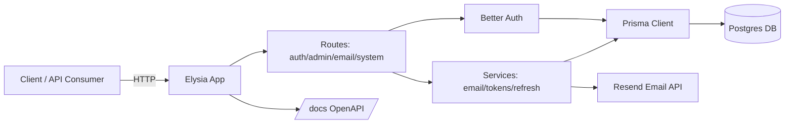

# elysia-better-auth-tempate   

Elysia boilerplate + Better Auth + Postgres DB.
Starter Elysia/Bun backend with Better Auth, Prisma (Postgres), React Email/Resend, clustering, rate limiting, CORS, logging, OpenAPI docs, and admin/role enforcement.

## Structure
- `src/app.ts` – Elysia app factory (prefix `/`), middleware, routes.
- `src/index.ts` – cluster bootstrap/startup.
- `src/routes/` – route modules (`auth`, `admin`, `email`, `system`).
- `src/services/` – auth, email, tokens, refresh-token helpers.
- `src/schemas/` – request validation (Elysia `t.*`).
- `src/lib/` – Prisma client, logger.
- `src/config/` – env parsing and normalized config.
- `src/utils/` – security headers, docs guard, password checks.
- `prisma/` – Prisma schema, migrations, seed.

## Overview / Architecture
- **Framework/runtime**: Elysia on Bun with clustering (`cluster`), rate limiting, CORS, security headers, and OpenAPI docs at `/docs`.
- **Auth**: Better Auth (email/password) with JWT/bearer, admin plugin, sessions + refresh tokens (hashed/digested), logout/revoke endpoints, and email verification toggle.
- **Data**: Prisma/Postgres (users/accounts/sessions/refresh tokens). Seed creates an admin user.
- **Email**: React Email templates with Resend sender.
- **Logging**: `elysia-logger`; environment-driven levels.
- **Routing**: API served under `/`; routes split by domain in `src/routes`.
- **Prisma 7 config**: datasource URL lives in `prisma.config.ts` (not `schema.prisma`). Migrations require `DATABASE_URL`; runtime uses the Prisma Postgres adapter (`@prisma/adapter-pg`) with `pg` pool.

## Features
- Better Auth (email/password) with JWT/bearer, admin plugin, session/refresh token flows, logout/revoke endpoints, and role sync.
- Prisma/Postgres schema (users/accounts/sessions/refresh tokens) with seed admin user.
- React Email + Resend send endpoint.
- Docker Compose for Postgres; clustering via Node `cluster`; structured logging via elysia-logger.
- OpenAPI docs at `/docs`.

## Setup
1. Install Bun 1.3.5+ (recommended via `asdf` with `.tool-versions`), then dependencies: `bun install`
2. Copy `.env.example` to `.env` and set:
   - Required: `DATABASE_URL`, `JWT_SECRET` (or `BETTER_AUTH_SECRET`, 32+ chars), `APP_ENCRYPTION_KEY` (32-byte base64/hex), `AUTH_BASE_URL`, `CORS_ORIGINS` (explicit origins in prod, not `*`).
   - Auth/Admin: `ADMIN_ROLE`, `ADMIN_EMAILS`, `EMAIL_VERIFICATION` (send), `EMAIL_VERIFICATION_ENFORCE` (block login until verified), `SIGNUP_MIN_PASSWORD_LENGTH`, `SIGNUP_PWNED_CHECKS`, `SIGNUP_RATE_LIMIT_WINDOW_MS`, `SIGNUP_RATE_LIMIT_MAX`.
   - Email: `RESEND_API_KEY`, `EMAIL_FROM` if using emails.
3. Start Postgres: `docker compose up -d db`
4. Migrate & seed: `DATABASE_URL=... bunx prisma migrate deploy && bunx prisma db seed` (Prisma 7 reads the URL from `prisma.config.ts` or env; `schema.prisma` no longer contains `url`).
5. Generate Prisma client: `DATABASE_URL=... bun run prisma:generate`
6. Run: `bun --watch src/index.ts` (or `docker compose up --build`)
7. Commits: follow [Conventional Commits](https://www.conventionalcommits.org/en/v1.0.0-beta.4/) for commit messages.

## Key Endpoints (prefix `/`)
- Auth: `/auth/signup`, `/auth/login`, `/auth/refresh`, `/auth/refresh/revoke`, `/auth/logout`, `/auth/logout-all`, `/auth/session/revoke`, `/auth/sessions`, `/auth/me`
- Admin: `/admin/users` (admin-only)
- Email: `/email/send`
- System: `/health`
- Docs: `/docs`

## Notes
- Refresh tokens are hashed and SHA-256 digested with max 5 active per user.
- Roles: Prisma `User.role` (default `user`); seed creates admin. Admin checks use `ADMIN_ROLE` and optional allowlist (`ADMIN_EMAILS`).

## Contributing
- Open to contributions and suggestions. Feel free to open issues or PRs.

## References
- Elysia best practices: https://elysiajs.com/essential/best-practice
- Better Auth docs: https://www.better-auth.com/docs/introduction
